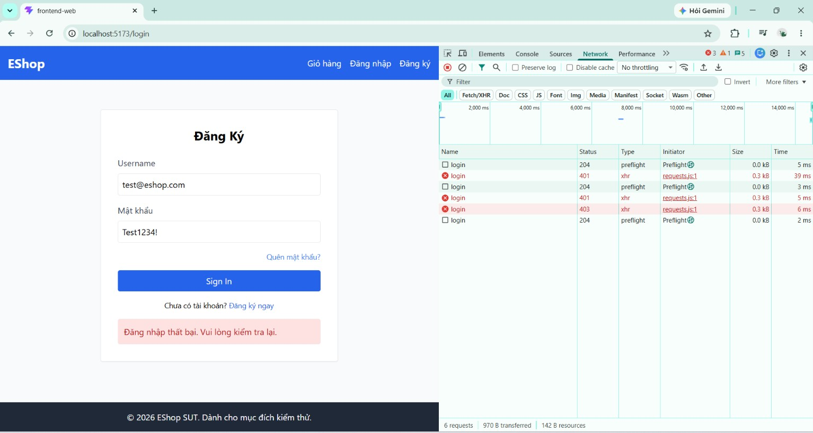

# BUG-FR02-001: Tài khoản bị khóa sau 2 lần đăng nhập sai thay vì 3 lần

## Found by Test Case
TC-FR02-DT-004, TC-FR02-BVA-001

## Requirement liên quan
FR-02

> FR-02 yêu cầu: "Sau mỗi lần đăng nhập sai, hệ thống tăng bộ đếm lên **đúng 1 đơn vị**" và "Nếu đăng nhập sai từ **3 lần trở lên** liên tiếp, tài khoản bị tạm khóa".

## Severity / Priority
High / P1

## Environment
**Browser**: Chrome
**OS**: Windows 11
**URL**: `http://localhost:5173` (trang Đăng nhập)
**Build / Commit**: `969e156` (branch `main`)

## Steps to reproduce
1. Đảm bảo tài khoản `test@eshop.com` ở trạng thái chưa bị khóa (nếu cần, chạy lại `node database.js` để reset).
2. Tại form Đăng nhập, nhập Email `test@eshop.com`, Mật khẩu `Wrong123!` → bấm Sign In (lần 1, báo lỗi).
3. Nhập lại `test@eshop.com` / `Wrong123!` → bấm Sign In (lần 2, báo lỗi).
4. Nhập `test@eshop.com` / `Test1234!` (mật khẩu ĐÚNG) → bấm Sign In.

## Expected result
Sau 2 lần sai, tài khoản CHƯA bị khóa (ngưỡng khóa là 3 lần sai liên tiếp). Bước 4 với mật khẩu đúng phải đăng nhập được và chuyển về trang chủ.

## Actual result
Tài khoản đã bị khóa ngay sau lần sai thứ 2. Ở bước 4 (mật khẩu đúng) đăng nhập vẫn bị từ chối: giao diện hiện "Đăng nhập thất bại. Vui lòng kiểm tra lại." và không chuyển trang. Kiểm tra DevTools → Network, request `login` trả về HTTP 403 `{"error":"Tài khoản đã bị khóa. Vui lòng thử lại sau."}`. Như vậy tài khoản bị khóa chỉ sau 2 lần sai (bộ đếm tăng nhanh hơn 1 đơn vị/lần).

## Evidence
Screenshot / video / console log

