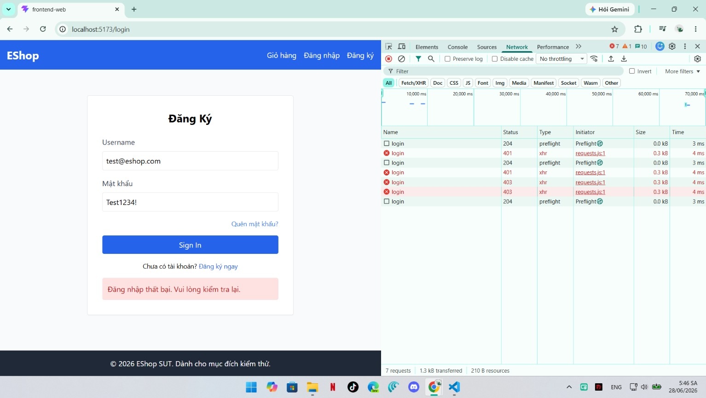

# BUG-FR02-002: Thời gian tạm khóa tài khoản kéo dài ~180 giây thay vì 30 giây

## Found by Test Case
TC-FR02-DT-007, TC-FR02-BVA-005, TC-FR02-BVA-006

## Requirement liên quan
FR-02

> FR-02 yêu cầu: "Nếu đăng nhập sai từ 3 lần trở lên liên tiếp, tài khoản bị tạm khóa **30 giây** (môi trường demo)."

## Severity / Priority
Medium / P2

## Environment
**Browser**: Chrome
**OS**: Windows 11
**URL**: `http://localhost:5173` (trang Đăng nhập)
**Build / Commit**: `969e156` (branch `main`)

## Steps to reproduce
1. Đảm bảo tài khoản `test@eshop.com` ở trạng thái chưa bị khóa (nếu cần, chạy lại `node database.js`).
2. Nhập sai mật khẩu vài lần để tài khoản bị khóa (Email `test@eshop.com`, Mật khẩu `Wrong123!`). Bắt đầu bấm giờ.
3. Chờ **hơn 30 giây** (kiểm tra ở mốc 30s và 31s), rồi nhập `test@eshop.com` / `Test1234!` (mật khẩu đúng) → bấm Sign In.

## Expected result
Sau khi đủ 30 giây, trạng thái tạm khóa kết thúc. Bước 3 với mật khẩu đúng phải đăng nhập được và chuyển về trang chủ.

## Actual result
Tại mốc 30 giây và 31 giây, tài khoản VẪN bị khóa: giao diện hiện "Đăng nhập thất bại. Vui lòng kiểm tra lại.", không chuyển trang (DevTools → Network: HTTP 403 "Tài khoản đã bị khóa. Vui lòng thử lại sau."). Thử lại liên tục bằng mật khẩu đúng cho thấy tài khoản chỉ mở khóa sau **~180 giây** kể từ lúc bị khóa.

So sánh quan sát theo mốc thời gian:
- 29 giây → bị từ chối (đúng kỳ vọng, còn trong thời gian khóa).
- 30 giây → vẫn bị từ chối (SAI, kỳ vọng cho đăng nhập lại).
- 31 giây → vẫn bị từ chối (SAI, kỳ vọng cho đăng nhập lại).
- ~180 giây → mới đăng nhập lại được.

## Evidence
Screenshot / video / console log

