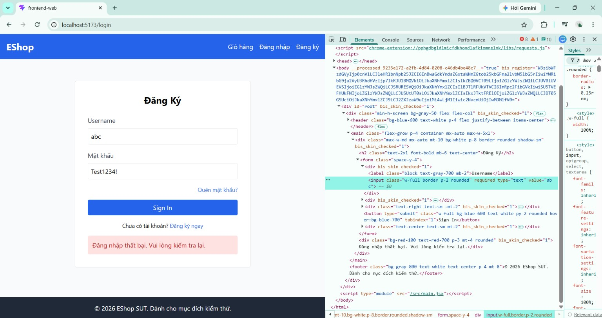

# BUG-FR02-003: Trường Email dùng `type="text"`, không validate định dạng HTML5

## Found by Test Case
TC-FR02-DT-002

## Requirement liên quan
FR-02

> FR-02 yêu cầu: "Trường email phải dùng `type="email"` (có validate HTML5 format)."

## Severity / Priority
Medium / P2

## Environment
**Browser**: Chrome
**OS**: Windows 11
**URL**: `http://localhost:5173` (trang Đăng nhập)
**Build / Commit**: `969e156` (branch `main`)

## Steps to reproduce
1. Mở trang Đăng nhập `http://localhost:5173`.
2. Nhập `abc` (email sai định dạng) vào trường Email.
3. Nhập `Test1234!` vào trường Mật khẩu.
4. Bấm Sign In và quan sát validation của trình duyệt.
5. Chuột phải vào ô Email → Inspect để xem thuộc tính `type` của ô nhập.

## Expected result
Trường Email dùng `type="email"` nên trình duyệt chặn submit và báo lỗi định dạng email khi giá trị là `abc`. Không thực hiện đăng nhập.

## Actual result
Trường Email được khai báo `type="text"` nên KHÔNG có validate HTML5 format. Giá trị `abc` được form chấp nhận và submit bình thường; kết quả chỉ hiện thông báo lỗi đăng nhập chung "Đăng nhập thất bại. Vui lòng kiểm tra lại.". Việc đăng nhập thất bại nhưng KHÔNG phải do form chặn theo HTML5 như yêu cầu.

Quan sát phụ liên quan: trường Mật khẩu cũng dùng `type="text"` thay vì `type="password"` → mật khẩu hiển thị rõ trên màn hình (nên cân nhắc tạo bug riêng).

## Evidence
Screenshot / video / console log

