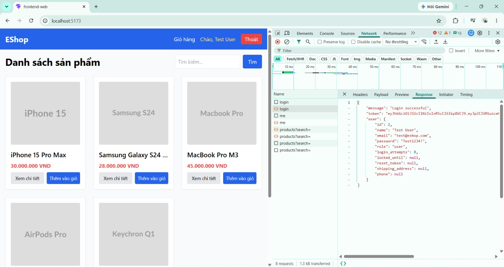

# BUG-FR02-004: API `/api/login` trả về mật khẩu plaintext trong response

## Found by Test Case
TC-FR02-DT-001 (quan sát trong khi thực thi)

## Requirement liên quan
FR-02

> Liên quan an toàn dữ liệu: phản hồi đăng nhập thành công chỉ nên trả về JWT token và thông tin người dùng cần thiết, không được để lộ thông tin nhạy cảm.

## Severity / Priority
Critical / P1

## Environment
**Browser**: Chrome
**OS**: Windows 11
**URL**: `http://localhost:5173` (trang Đăng nhập)
**Build / Commit**: `969e156` (branch `main`)

## Steps to reproduce
1. Mở DevTools (F12) → tab Network.
2. Tại form Đăng nhập, nhập `test@eshop.com` / `Test1234!` → bấm Sign In (đăng nhập thành công).
3. Trong tab Network, chọn request `login` → mở tab **Response** (hoặc **Preview**) và quan sát nội dung trả về.

## Expected result
Response chỉ chứa token và các trường thông tin người dùng an toàn (id, name, email, role...). KHÔNG chứa mật khẩu (dù plaintext hay hash).

## Actual result
Response của đăng nhập thành công trả về nguyên đối tượng `user`, bao gồm cả `"password":"Test1234!"` (plaintext) và các trường nội bộ như `login_attempts`, `locked_until`, `reset_token`. Mật khẩu người dùng bị lộ trong phản hồi mạng.

## Evidence
Nội dung response của đăng nhập thành công (xem trong DevTools → Network → Response):
```json
{
  "message": "Login successful",
  "token": "eyJhbGciOiJIUzI1NiIsInR5cCI6IkpXVCJ9...",
  "user": {
    "id": 2,
    "name": "Test User",
    "email": "test@eshop.com",
    "password": "Test1234!",
    "role": "user",
    "login_attempts": 0,
    "locked_until": null,
    "reset_token": null,
    "shipping_address": null,
    "phone": null
  }
}
```


