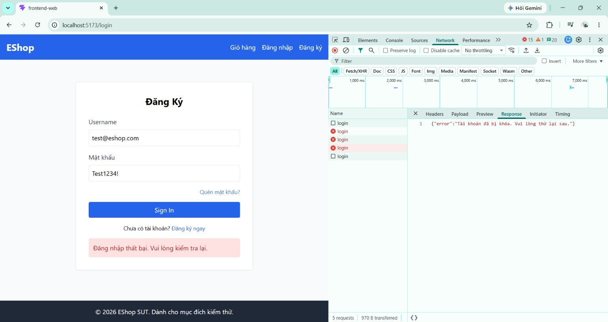

# BUG-FR02-005: Tài khoản bị khóa nhưng giao diện chỉ hiển thị thông báo lỗi chung

## Found by Test Case
TC-FR02-DT-006 (quan sát trong khi thực thi)

## Requirement liên quan
FR-02

> FR-02 có cơ chế khóa tài khoản tạm thời. Khi tài khoản đang bị khóa, người dùng cần được thông báo rõ ràng là tài khoản đã bị khóa (và nên thử lại sau) để hiểu vì sao không đăng nhập được.

## Severity / Priority
Medium / P2

> Lý do: không chặn chức năng (cơ chế khóa vẫn hoạt động) nhưng gây nhầm lẫn cho người dùng — họ không biết tài khoản đã bị khóa, tưởng do nhập sai mật khẩu nên tiếp tục thử. Nên sửa trong vòng hiện tại.

## Environment
**Browser**: Chrome
**OS**: Windows 11
**URL**: `http://localhost:5173` (trang Đăng nhập)
**Build / Commit**: `969e156` (branch `main`)

## Steps to reproduce
1. Mở trang Đăng nhập `http://localhost:5173`.
2. Nhập sai mật khẩu cho `test@eshop.com` liên tiếp đến khi tài khoản bị khóa.
3. Nhập đúng mật khẩu `Test1234!` của `test@eshop.com` và bấm Sign In.
4. Quan sát thông báo hiển thị trên giao diện.
5. (Tùy chọn) Mở DevTools (F12) → tab Network → chọn request `login` → tab Response để so sánh thông báo của backend.

## Expected result
Khi tài khoản đang bị khóa, giao diện hiển thị thông báo khóa cụ thể (ví dụ: "Tài khoản đã bị khóa. Vui lòng thử lại sau.") để người dùng hiểu nguyên nhân.

## Actual result
Giao diện luôn hiển thị cùng một thông báo lỗi chung "Đăng nhập thất bại. Vui lòng kiểm tra lại." dù tài khoản đang bị khóa. Trong khi đó, backend thực tế trả về phản hồi `403` với message riêng "Tài khoản đã bị khóa. Vui lòng thử lại sau." (xem trong DevTools → Network → Response), nhưng frontend không hiển thị thông báo này — khối `catch` luôn ghi đè bằng message chung. Người dùng không được biết tài khoản đã bị khóa.

## Evidence
Screenshot / video / console log

