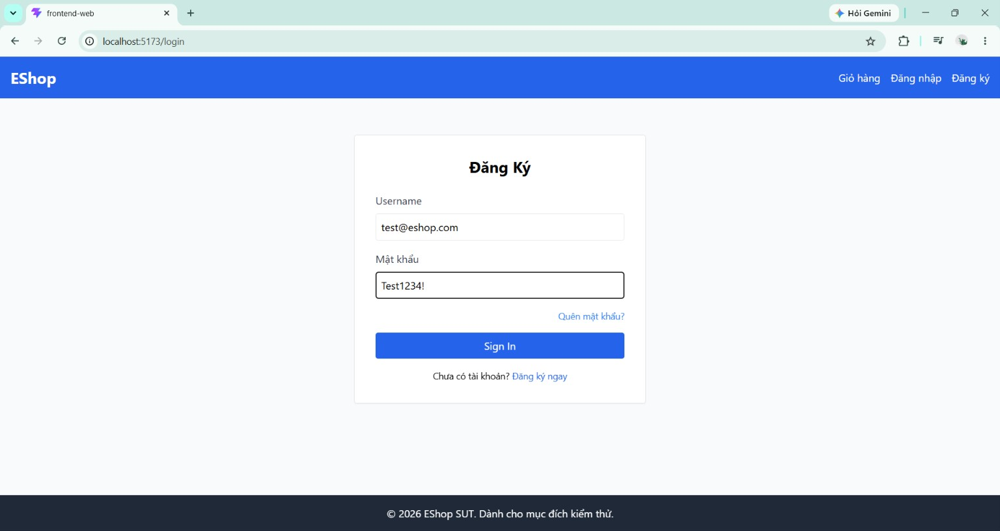

# BUG-FR02-006: Trường Mật khẩu dùng `type="text"`, mật khẩu hiển thị plaintext trên màn hình

## Found by Test Case
TC-FR02-DT-009 (quan sát trong khi thực thi)

## Requirement liên quan
FR-02

> Liên quan an toàn dữ liệu nhập liệu: ô nhập mật khẩu phải dùng `type="password"` để che ký tự khi người dùng gõ, tránh lộ mật khẩu cho người nhìn cạnh màn hình (shoulder surfing).

## Severity / Priority
Medium / P2

> Lý do: không chặn luồng đăng nhập nhưng làm lộ mật khẩu trực tiếp trên giao diện → rủi ro bảo mật/quyền riêng tư. Cần sửa trong vòng hiện tại.

## Environment
**Browser**: Chrome
**OS**: Windows 11
**URL**: `http://localhost:5173` (trang Đăng nhập)
**Build / Commit**: `969e156` (branch `main`)

## Steps to reproduce
1. Mở trang Đăng nhập `http://localhost:5173`.
2. Bấm vào ô Mật khẩu và gõ `Test1234!`.
3. Quan sát các ký tự hiển thị ngay trên ô nhập.
4. (Tùy chọn) Chuột phải vào ô Mật khẩu → Inspect để xem thuộc tính `type` của ô nhập.

## Expected result
Ô Mật khẩu dùng `type="password"` → các ký tự được thay bằng dấu chấm/sao (•••), mật khẩu không hiển thị rõ trên màn hình.

## Actual result
Ô Mật khẩu được khai báo `type="text"` → toàn bộ ký tự mật khẩu `Test1234!` hiển thị rõ ràng (plaintext) trên giao diện trong khi gõ. Bất kỳ ai nhìn vào màn hình đều đọc được mật khẩu.

## Evidence
Screenshot / video / console log

