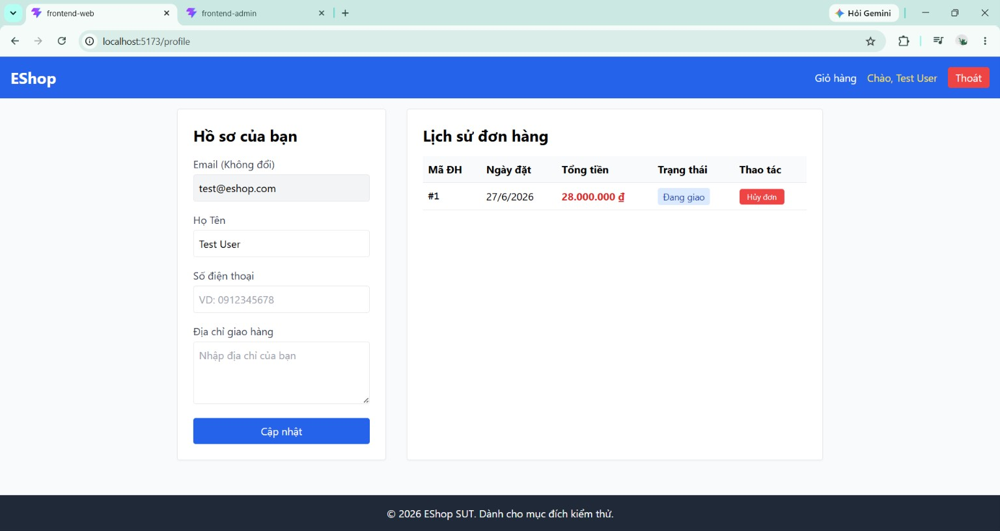
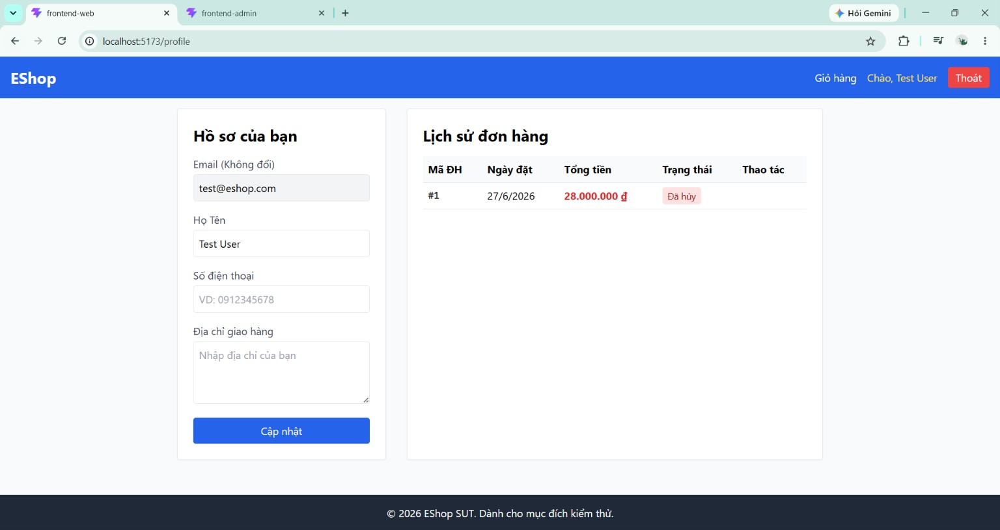

# BUG-FR10-001: User tự hủy được đơn hàng đang giao (`shipping`)

## Found by Test Case
TC-FR10-DT-010

## Requirement liên quan
FR-10

> FR-10: "Khi đơn hàng đã ở trạng thái `shipping`, **User không được phép tự hủy** — chỉ Admin mới có thể thao tác." Trạng thái chỉ được chuyển theo state machine đã định nghĩa.

## Severity / Priority
High / P1

> Lý do: vi phạm trực tiếp một ràng buộc nghiệp vụ được nêu rõ trong FR-10; đơn hàng đang giao bị User hủy gây sai lệch quy trình giao hàng/đối soát, không có workaround ở phía người dùng. Cần sửa ngay.

## Environment
**Browser**: Chrome
**OS**: Windows 11
**URL**: `http://localhost:5173` (Web → Hồ sơ → Lịch sử đơn hàng)
**Build / Commit**: `85af3ba` (branch `main`)

## Steps to reproduce
1. Đăng nhập web bằng tài khoản User `test@eshop.com` / `Test1234!`.
2. Tạo một đơn hàng (thêm sản phẩm vào giỏ → Checkout) để có đơn `pending`.
3. Nhờ Admin đưa đơn này sang trạng thái `shipping` (Admin: Xác nhận → Giao hàng).
4. Quay lại web bằng tài khoản User → vào **Hồ sơ → Lịch sử đơn hàng**.
5. Quan sát đơn đang ở trạng thái "Đang giao" (`shipping`) và bấm nút **"Hủy đơn"**.

## Expected result
Hệ thống không cho User hủy đơn ở trạng thái `shipping`: nút "Hủy đơn" không xuất hiện (hoặc thao tác bị từ chối với thông báo phù hợp), và trạng thái đơn vẫn là `shipping`.

## Actual result
Nút "Hủy đơn" vẫn hiển thị cho đơn đang `shipping`. Khi bấm, hệ thống hiển thị "Hủy đơn thành công!" và đơn chuyển sang `canceled`. User đã tự hủy được đơn đang giao — đúng tình huống FR-10 cấm.

## Evidence
Screenshot / video / console log

**Ảnh 1 — Đơn đang `shipping` ("Đang giao") nhưng vẫn hiển thị nút "Hủy đơn":**

**Ảnh 2 — Sau khi bấm "Hủy đơn": hệ thống báo thành công và đơn chuyển sang "Đã hủy":**

