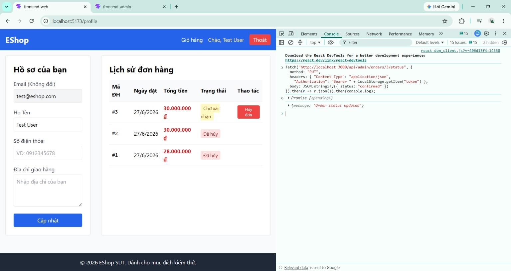
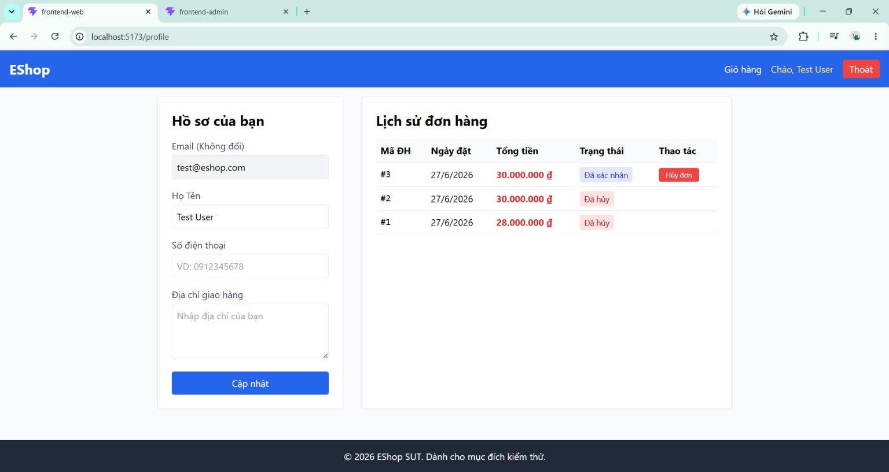

# BUG-FR10-002: Endpoint đổi trạng thái đơn hàng không kiểm tra quyền Admin/sở hữu

## Found by Test Case
TC-FR10-DT-011

## Requirement liên quan
FR-10

> FR-10: các thao tác xác nhận, giao hàng, hoàn tất đơn hàng là thao tác của **Admin** ("[Admin xác nhận]", "[Admin giao hàng]", "[Admin hoàn tất]"). FR-18: "Admin có thể chuyển đổi trạng thái đơn hàng theo đúng State Machine". Quyền này phải được thực thi ở phía server, không chỉ ẩn nút trên giao diện.

## Severity / Priority
Critical / P1

> Lý do: lỗi kiểm soát truy cập (broken access control). Endpoint đổi trạng thái chỉ yêu cầu đăng nhập, không kiểm tra vai trò Admin lẫn quyền sở hữu đơn → bất kỳ người dùng đã đăng nhập nào cũng có thể thay đổi trạng thái đơn hàng của **bất kỳ ai**. Rủi ro toàn vẹn dữ liệu và bảo mật nghiêm trọng, cần sửa ngay.

## Environment
**Browser**: Chrome
**OS**: Windows 11
**URL**: Web `http://localhost:5173` · Endpoint `PUT http://localhost:3000/api/admin/orders/:id/status`
**Build / Commit**: `85af3ba` (branch `main`)

## Steps to reproduce
1. Đăng nhập web bằng tài khoản **User** thường `test@eshop.com` / `Test1234!` (không phải Admin).
2. Tạo một đơn hàng để có đơn `pending`, ghi nhớ mã đơn.
3. Xác nhận trang Admin (`http://localhost:5174`) **chặn** đăng nhập bằng tài khoản User này (kiểm tra role ở giao diện) → tưởng như User không thao tác được.
4. Mở DevTools (F12) → tab **Console**, dùng chính phiên đăng nhập của User gửi yêu cầu đổi trạng thái tới endpoint của Admin:
   ```js
   fetch("http://localhost:3000/api/admin/orders/<ORDER_ID>/status", {
     method: "PUT",
     headers: {
       "Content-Type": "application/json",
       "Authorization": "Bearer " + localStorage.getItem("token")
     },
     body: JSON.stringify({ status: "confirmed" })
   }).then(r => r.json()).then(console.log);
   ```
5. Quan sát phản hồi và kiểm tra lại trạng thái đơn.

## Expected result
Server từ chối thao tác vì người gọi không phải Admin (ví dụ HTTP 403 Forbidden), trạng thái đơn vẫn là `pending`.

## Actual result
Server trả về HTTP 200 `{"message":"Order status updated"}` và đơn chuyển sang `confirmed` dù người gọi chỉ là User thường. Endpoint `PUT /api/admin/orders/:id/status` không kiểm tra vai trò Admin cũng như không kiểm tra quyền sở hữu đơn → User có thể đổi trạng thái đơn của bất kỳ ai.

## Evidence
Screenshot / video / console log

**Ảnh 1 — Trang Admin chặn tài khoản User đăng nhập (kiểm tra role chỉ ở giao diện):**



**Ảnh 2 — Gửi yêu cầu đổi trạng thái bằng phiên đăng nhập của User qua DevTools Console: server trả HTTP 200 và đơn chuyển "Đã xác nhận":**


