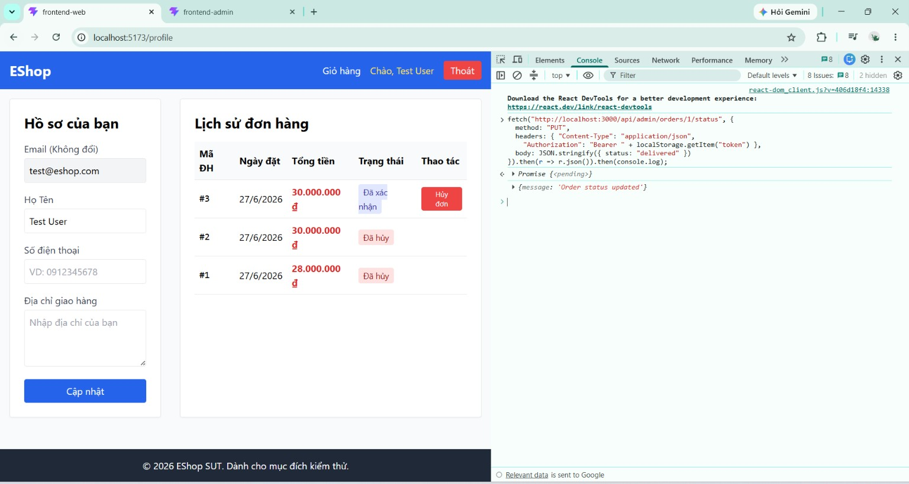
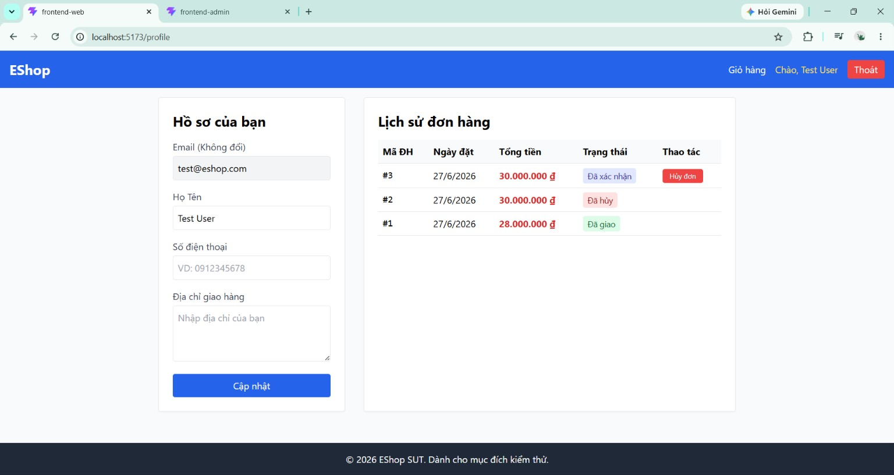

# BUG-FR10-003: Cho phép chuyển từ trạng thái kết thúc `canceled` sang `delivered`

## Found by Test Case
TC-FR10-DT-009 (quan sát trong khi thực thi)

## Requirement liên quan
FR-10

> FR-10: "Trạng thái `delivered` và `canceled` là **trạng thái kết thúc** — không được phép chuyển sang bất kỳ trạng thái nào khác." Mọi chuyển đổi không hợp lệ phải trả về lỗi.

## Severity / Priority
High / P2

> Lý do: vi phạm ràng buộc final state của state machine; một đơn đã `canceled` có thể bị "hồi sinh" thành `delivered`, làm sai lệch dữ liệu đơn hàng và doanh thu (trang Admin tính doanh thu dựa trên đơn `delivered`). Không lộ trên giao diện Admin (đơn `canceled` không có nút) nên khả năng xảy ra thấp hơn, xếp P2; nhưng tác động dữ liệu/tài chính cao nên Severity High.

## Environment
**Browser**: Chrome
**OS**: Windows 11
**URL**: Endpoint `PUT http://localhost:3000/api/admin/orders/:id/status` (trang Admin `http://localhost:5174`)
**Build / Commit**: `85af3ba` (branch `main`)

## Steps to reproduce
1. Đăng nhập tài khoản Admin `admin@eshop.com` / `Admin123!`.
2. Chuẩn bị một đơn ở trạng thái `canceled` (ví dụ tạo đơn rồi hủy).
3. Trên trang Admin, đơn `canceled` không hiển thị nút thao tác nào. Mở DevTools (F12) → tab **Console**, gửi yêu cầu chuyển đơn sang `delivered`:
   ```js
   fetch("http://localhost:3000/api/admin/orders/<ORDER_ID>/status", {
     method: "PUT",
     headers: {
       "Content-Type": "application/json",
       "Authorization": "Bearer " + localStorage.getItem("token")
     },
     body: JSON.stringify({ status: "delivered" })
   }).then(r => r.json()).then(console.log);
   ```
4. Quan sát phản hồi và kiểm tra lại trạng thái đơn.

## Expected result
Server từ chối thao tác (ví dụ HTTP 400 "Invalid state transition from canceled to delivered") vì `canceled` là trạng thái kết thúc; trạng thái đơn vẫn là `canceled`.

## Actual result
Server trả về HTTP 200 `{"message":"Order status updated"}` và đơn chuyển từ `canceled` sang `delivered`. Trong khi đó các chuyển đổi khác từ `canceled` (ví dụ `canceled → pending`) lại bị từ chối đúng — chỉ riêng `canceled → delivered` được chấp nhận sai.

## Evidence
Screenshot / video / console log

**Ảnh 1 — Đơn đang ở trạng thái kết thúc "Đã hủy" (`canceled`):**



**Ảnh 2 — Sau khi gửi yêu cầu qua Console: server trả HTTP 200, đơn chuyển sang "Đã giao" (`delivered`):**


