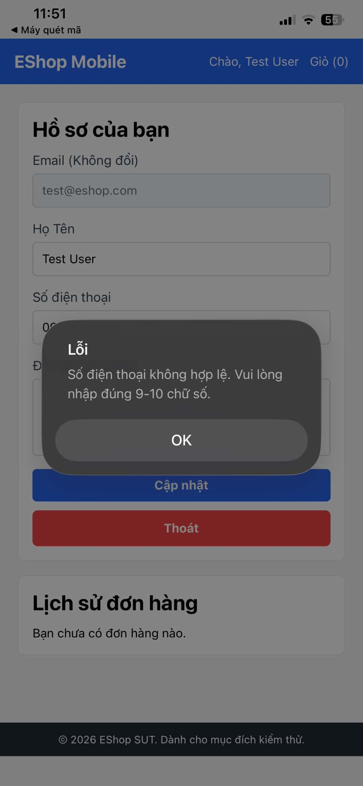
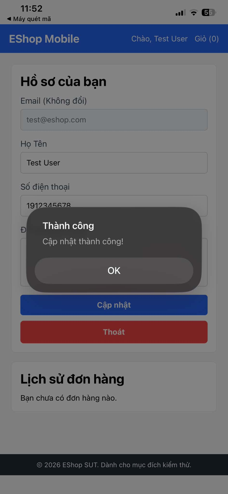

# BUG-FR26-001: Validate số điện thoại trên mobile bị đảo ngược so với yêu cầu

## Found by Test Case
TC-FR26-DT-001, TC-FR26-DT-002, TC-FR26-DT-003, TC-FR26-BVA-002, TC-FR26-BVA-003

## Requirement liên quan
FR-26

> FR-26: "**Số điện thoại hợp lệ**: bắt đầu bằng số `0`, từ 10–11 chữ số." Giao diện mobile phải hiển thị thông báo thành công khi cập nhật hợp lệ, hoặc lỗi khi nhập số điện thoại không hợp lệ.

## Severity / Priority
High / P1

> Lý do: quy tắc kiểm tra số điện thoại bị đảo ngược hoàn toàn so với requirement. Số điện thoại Việt Nam hợp lệ (luôn bắt đầu bằng `0`) đều bị từ chối → người dùng **không thể cập nhật hồ sơ** với số điện thoại đúng (không có workaround), đồng thời số sai lại được chấp nhận. Lỗi chức năng cốt lõi, cần sửa ngay.

## Environment
**Thiết bị / App**: Mobile (Expo)
**OS**: Windows 11 / Android
**Màn hình**: Hồ sơ của bạn → ô "Số điện thoại"
**Backend**: `http://localhost:3000`
**Build / Commit**: `85af3ba` (branch `main`)

## Steps to reproduce
1. Mở app Mobile, đăng nhập User `test@eshop.com` / `Test1234!`.
2. Vào màn hình **Hồ sơ của bạn**.
3. Nhập số điện thoại **hợp lệ** `0912345678` (bắt đầu `0`, 10 số) vào ô "Số điện thoại" → bấm **"Cập nhật"**.
4. Quan sát thông báo.
5. Đổi số điện thoại sang `1912345678` (KHÔNG bắt đầu bằng `0`) → bấm **"Cập nhật"** và quan sát thông báo.

## Expected result
- Với `0912345678` và `09123456789` (hợp lệ): cập nhật thành công, hiển thị thông báo thành công.
- Với `1912345678` (không bắt đầu `0`): bị từ chối, hiển thị lỗi số điện thoại không hợp lệ, hồ sơ không thay đổi.

## Actual result
Ngược với yêu cầu:
- Số hợp lệ `0912345678` và `09123456789` (đều bắt đầu `0`) bị **từ chối** với thông báo "Số điện thoại không hợp lệ. Vui lòng nhập đúng 9-10 chữ số." và hồ sơ KHÔNG được cập nhật.
- Số không hợp lệ `1912345678` (không bắt đầu `0`) lại được **chấp nhận** và lưu thành công.

Nguyên nhân: quy tắc kiểm tra của app yêu cầu chữ số đầu là `1–9` và độ dài 9–10 chữ số (ngược với "bắt đầu bằng `0`, 10–11 chữ số"). Nội dung thông báo lỗi ("đúng 9-10 chữ số") cũng sai so với requirement.

## Evidence
Screenshot / video / console log

**Ảnh 1 — Nhập SĐT hợp lệ `0912345678` nhưng app báo lỗi "không hợp lệ" và không cập nhật:**

**Ảnh 2 — Nhập SĐT `1912345678` (không bắt đầu bằng `0`) lại được chấp nhận, "Cập nhật thành công":**

